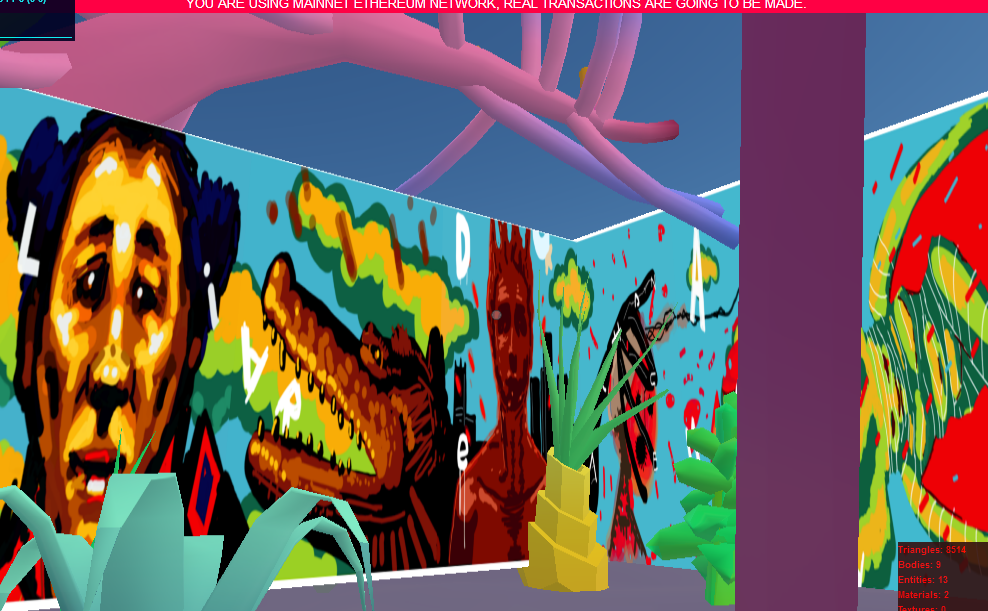

# Perrodrilo in Decentraland

DADA gallery in Decentraland showcasing the recently auctioned 'Sight Unseen'
conversation.





We are still figuring out a way to deploy this scene in Now. Once done, [this link](https://perrodrilo-git-master.wairiukosimon.now.sh) takes you to a copy of the scene where you can interact with it without having to install Decentraland SDK, CLI or Node.js and without any programming knowledge. For those who are interested in running the scene locally, you can follow the procedure below. Note you need to have Node.js and npm already installed in your computer. For more details, follow the steps in the [Installation guide](https://docs.decentraland.org/documentation/installation-guide/).


**Install the CLI**

Download and install the Decentraland CLI by running the following command

```bash
npm i -g decentraland
```

**Previewing the scene**

Once you've installed the CLI, download this project and navigate to its directory from your terminal or command prompt.

#### Run the scene preview

```sh
# from the project root
cd <perrodrilo>

# install node dependencies
npm install

# start the preview
dcl start
```

Any dependencies are installed and then the CLI will open the scene in a new browser tab automatically.

**Usage**
Navigate freely to enjoy the amazing work by artists from different continents!


## Copyright info (For the sake of Git Protocol)

Apache 2 licence. See the terms and conditions in the [LICENSE](/LICENSE) file.
